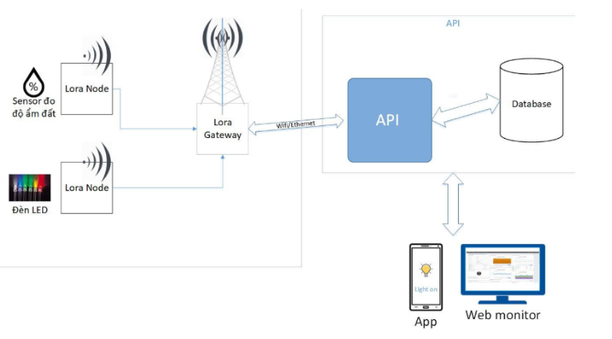
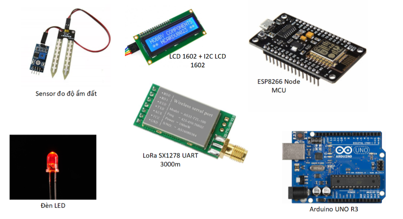
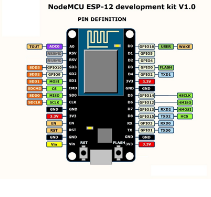
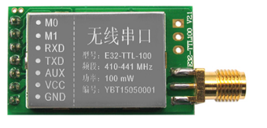
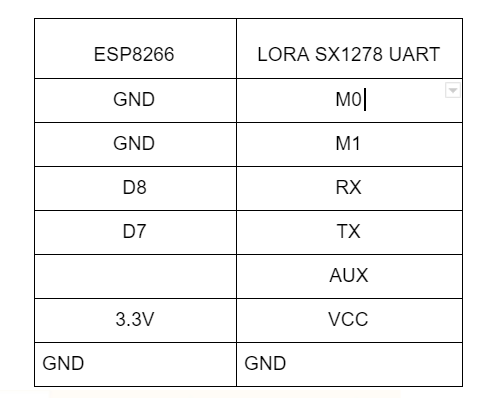
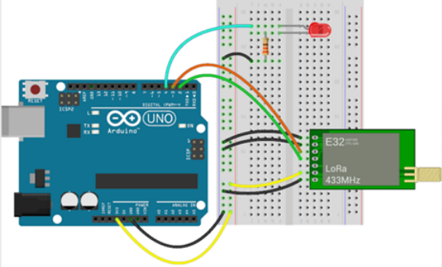

# lora-sample-code
Use Lora technical for IoTs

This demo use esp8266 node MCU, Lora sx1278 UART, Arduino Uno R3, LED, soil humidity sensor.

The system architect:

The device is used in this project:

I use 1 Lora sx1278 board as a master node and 2 Lora sx1278 board as two slave node.
It has the same frequency.

Pinout of ESP8266

Pinout of LoRa SX1278

Before use LoRa SX1278, you need set up something for its. You can follow the link: https://hshop.vn/products/mach-thu-phat-rf-lora-uart-sx1278-433mhz3000m .
This page has a tutorial on how to configure the first time LoRa usage.

After setup LoRa SX1278 successful you will physically connect the others.

Pinout connect ESP8266 and LoRa SX1278

Pinout connection between Arduino Uno R3 and Lora SX1278

